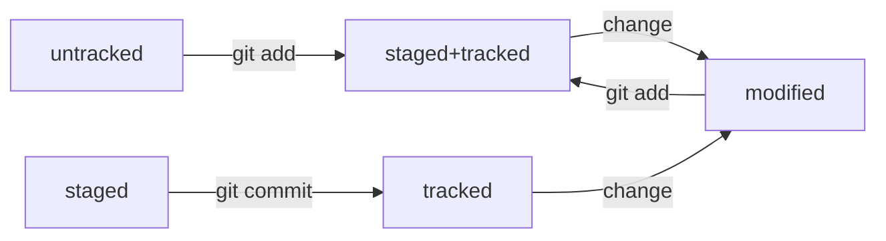

## Команды
1) _cat_ - вывод содержимого файла в консоль
2) _rm_ - удалить файл
3) _pwd_ - показать текущую директорию
4) _cd_ -  сменить директорию
5) _ls_ -  вывести содержимое директории
6) _touch_ - создание файла
7) _mkdir_ - создание дирктории
8) _cp_ - копирование
9) _mv_ - перемещение

## Информация о Хеше
1) Git преобразует информацию о коммитах с помощью алгоритма SHA-1 и для каждого из них рассчитывает уникальный идентификатор — хеш.
2) Хеш — основной идентификатор коммита и позволяет узнать его автора, дату и содержимое закоммиченных файлов.
3) Все хеши, а также таблицу соответствий хеш → информация о коммите Git хранит в папке .git.

## Информация о git log 
1) Можно вызвать не только полный лог, но и сокращённый — это делается командой git log --oneline.
2) В сокращённом логе выводятся сокращённые хеши — их можно использовать точно так же, как и полные.

## Информация о HEAD 
1) В числе прочих файлов в папке .git есть служебный файл HEAD. Он указывает на самый свежий коммит.
2) Вместо хеша последнего коммита можно написать слово HEAD — Git вас поймёт.

## Статусы файлов в Git
1) Статусом untracked помечается файл, о существовании которого Git знает, но не следит за изменениями в нём. Этот статус — противоположность tracked, в который попадают все файлы, отслеживаемые Git.
2) Файл переходит в статус staged после выполнения git add.
3) Статус modified означает, что файл был изменён.
4) Большинство файлов в проектах «шагает» по следующему циклу: «изменён» → «добавлен в список на коммит» → «закоммичен» → «изменён» → и так далее.

## Статусы файлов git status   
1) Команда git status всегда подскажет, что происходит с файлом: например, он добавлен в список «на коммит» или ещё вообще не отслеживается, или изменён.
2) git status показывает явно следующие состояния файлов: untracked, staged и modified.
3) git status подсказывает, какие команды можно выполнить, чтобы поменять состояние файла.